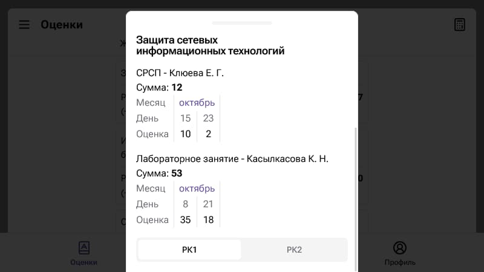

# Univer

Веб-приложение для просмотра оценок, расписания занятий и экзаменов, и другой  информации о студенте.

Приложение доступно по ссылке — [univer.eloh1m.com](https://univer.eloh1m.com)

## Возможности

- 📅 Расписание
- ✅ Расписание экзаменов
- 📕 Оценки
- 🔢 Калькулятор оценок
- 📄 УМКД
- 👤 Транскрипт

## Особенности

- 🌗 Светлая и тёмная темы
- 🌐 Многоязычность
- 📱 Прогрессивное веб-приложение

## Скриншоты

## Библиотеки и фреймворки

Фронтенд

- [Svelte](https://svelte.dev/)
- [Material You](https://m3.material.io/)

Бекенд

- [Aiohttp](https://docs.aiohttp.org/)
- [Aiofiles](https://github.com/Tinche/aiofiles)
- [BeautifulSoup](https://www.crummy.com/software/BeautifulSoup/bs4/doc/)
- [markdown](https://python-markdown.github.io/)

## Обратная связь

Телеграм-канал — [@univerapp](https://t.me/univerapp)
